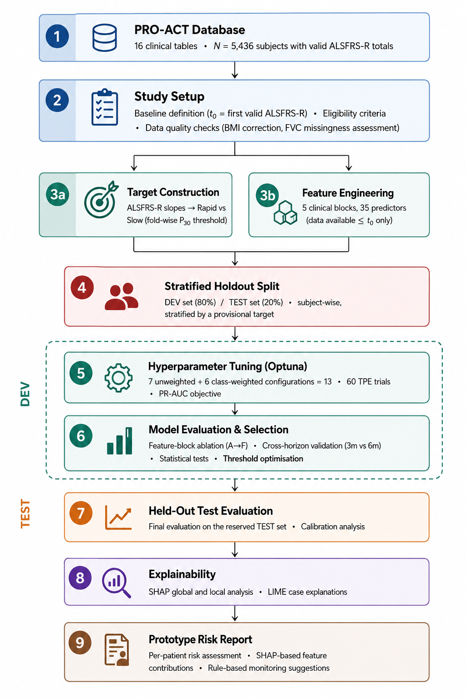
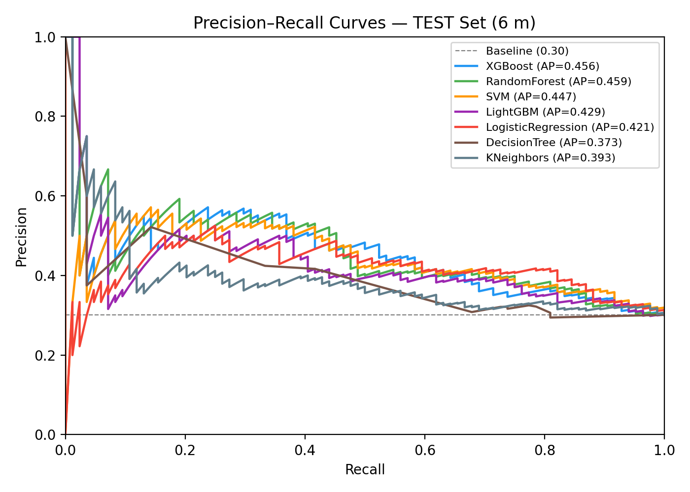
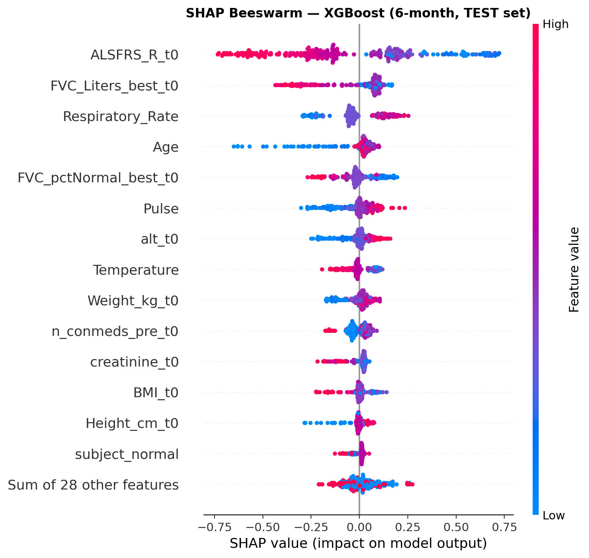
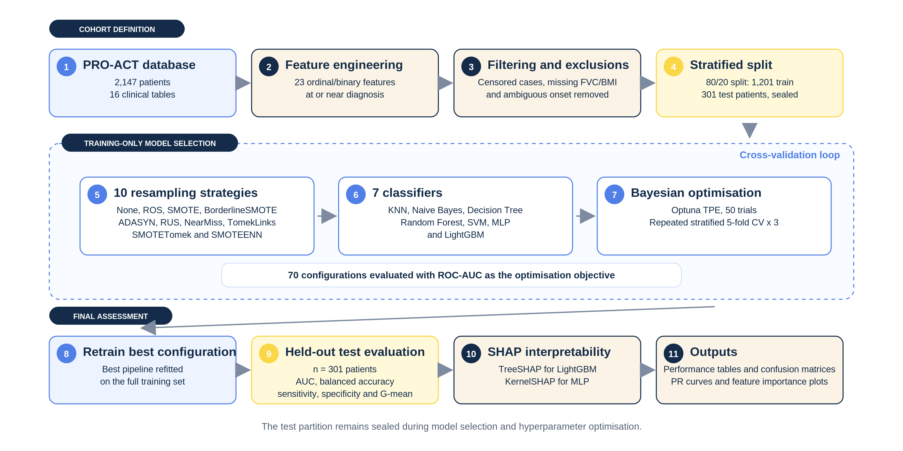
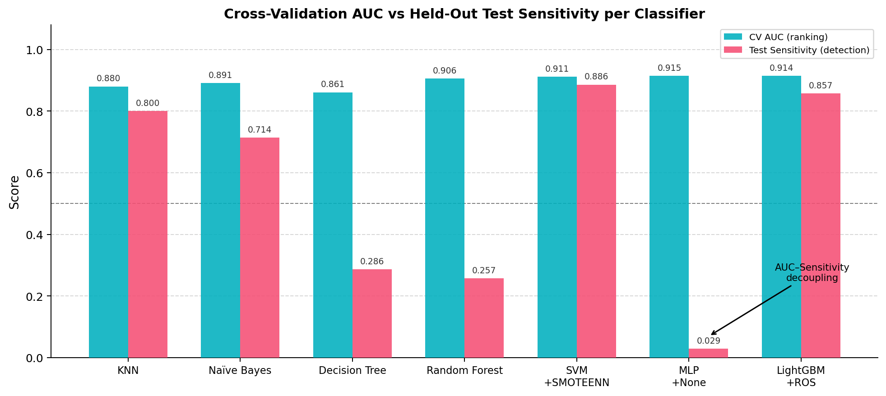
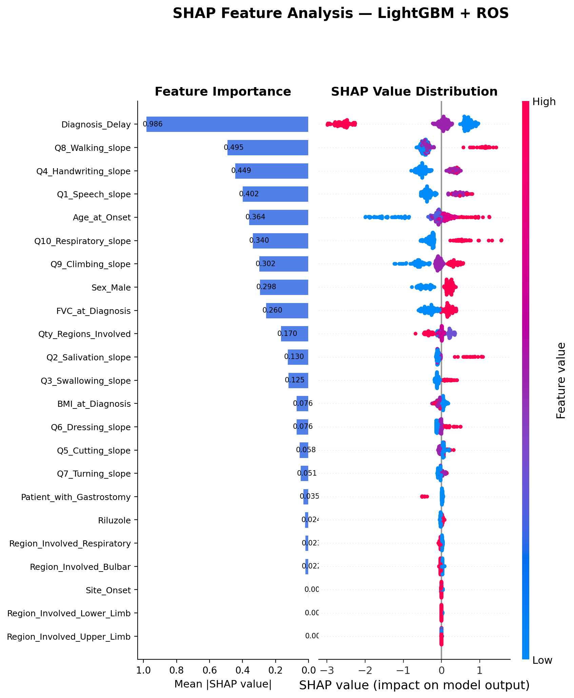

# Explainable and Reproducible Machine Learning for ALS Prognosis

**Functional Progression Classification and Survival Prediction**

MSc dissertation project by **Ivo Nunes Camacho**, developed at the School of Management and Technology, Polytechnic University of Santarem, under the supervision of **Maryam Abbasi** and **Pedro Martins**.

This repository contains the dissertation source, analysis code, notebooks, generated tables, and figures for two machine-learning studies based on the Pooled Resource Open-Access ALS Clinical Trials (PRO-ACT) database. The studies address different prognosis outcomes but share the same methodological question:

> Does good ranking performance translate into useful decisions at a chosen classification threshold?

The work focuses on patient-level data separation, class imbalance, threshold selection, uncertainty, explainability, and the distinction between model discrimination and behaviour at a specific operating point.

## Project at a glance

| | Study I: Functional progression | Study II: Survival prognosis |
|---|---|---|
| Outcome | Rapid vs slow ALSFRS-R decline | Death within 24 months of symptom onset |
| Prediction horizon | 3 and 6 months | Fixed 24-month survival target |
| Primary cohort | 1,392 patients at 6 months | 1,502 complete-case patients |
| Predictors | 35 baseline clinical features | 23 ordinal and binary clinical features |
| Model comparison | 7 classifiers, 13 supported class-weight configurations | 7 classifiers, 10 imbalance strategies |
| Optimisation metric | PR-AUC | ROC-AUC |
| Validation | Grouped cross-validation and a patient-level held-out test set | Repeated stratified cross-validation and a held-out test set |
| Explainability | SHAP, LIME, and logistic-regression coefficients | TreeSHAP for LightGBM and KernelSHAP for MLP |

## Study I: Functional progression

Study I predicts rapid ALSFRS-R decline from information available at or before the first valid functional assessment. Targets are estimated from later assessments at three- and six-month horizons. Patients are separated before model development, and the rapid-progression cutoff is estimated within each training fold to prevent target leakage.

<p align="center">
  
</p>

The primary six-month cohort contained 1,392 patients. XGBoost was selected from development results and achieved a held-out PR-AUC of **0.456** (95% CI: 0.364-0.568), compared with a rapid-progression prevalence of 0.301. At the exploratory development-derived threshold of 0.21, it detected 72 of 84 rapid progressors:

- Recall: **85.7%**
- Precision: **35.1%**
- False positives: **133**

The threshold therefore favoured sensitivity at a substantial cost in specificity. It is an exploratory operating point rather than a clinically validated decision boundary.

<p align="center">
  
</p>

SHAP analysis assigned the largest contributions to baseline ALSFRS-R and forced vital capacity. LIME explanations and logistic-regression coefficients were used as complementary views of global and patient-level model behaviour. The analysis also includes feature-block ablation, calibration, error profiles, subgroup estimates, learning curves, decision-curve analysis, bootstrap confidence intervals, and missing-data sensitivity analysis.

<p align="center">
  
</p>

## Study II: Survival prognosis

Study II partially replicates and extends the BalancedBagging framework reported by Papaiz et al. for identifying Short Survivors. It compares seven classifiers across ten imbalance-handling strategies, adds LightGBM and Bayesian optimisation, and evaluates the selected configurations on a held-out test set.

<p align="center">
  
</p>

The complete-case cohort contained 1,502 patients, including 174 Short Survivors. LightGBM with random oversampling produced the strongest balance at the default threshold on the 301-patient test set:

- ROC-AUC: **0.923** (95% CI: 0.868-0.966)
- Sensitivity: **0.857**
- Specificity: **0.831**
- Short Survivors detected: **30 of 35**

The results illustrate why a ranking metric cannot describe threshold-dependent behaviour by itself. The MLP obtained a similar test ROC-AUC of 0.918 but detected only one of 35 Short Survivors at the default threshold. A sensitivity-constrained threshold selected from out-of-fold development predictions increased test sensitivity to 0.771 while retaining specificity of 0.883.

<p align="center">
  
</p>

BalancedBagging increased cross-validated balanced accuracy for six of the seven classifiers. Among the five model families directly comparable with the reference study, four reproduced the reported qualitative improvement and Naive Bayes remained the exception.

<p align="center">
  
</p>

The closest-record feature definition used in this replication selected predominantly post-diagnosis assessments. Study II must therefore not be interpreted as a diagnosis-time prediction model. An expanded-cohort iterative-imputation analysis is included as a sensitivity analysis for the complete-case design.

## Main conclusion

Across both studies, model ranking and classification behaviour were related but not interchangeable. Outcome construction, patient separation, missing-data handling, imbalance strategy, and threshold choice materially changed how the models were interpreted. The reported results are internally validated within a clinical-trial database; they are not evidence of readiness for clinical deployment.

External validation should use independent ALS cohorts with different recruitment settings and missingness patterns. Prospective evaluation would then need to define the intended user, prediction timepoint, intervention triggered by a positive result, and relative cost of false-negative and false-positive decisions.

## Repository structure

```text
.
|-- 01_data/                    # Local PRO-ACT raw, interim, and processed data
|-- 02_notebooks/               # Study I target, feature, modelling, and EDA notebooks
|-- 03_src/                     # Study I data, tuning, evaluation, XAI, and reporting code
|-- 04_outputs/                 # Study I aggregate tables and generated figures
|-- models/                     # Local fitted-model artefacts (not versioned)
|-- overleaf/                   # Complete LaTeX dissertation and publication figures
`-- replication/
    |-- 01_data/                # Local Study II data products
    |-- 02_scripts/             # Study II pipeline and sensitivity analyses
    |-- 03_outputs/             # Study II aggregate results and figures
    `-- overleaf/               # Study II paper material
```

Patient-level source and derived data are intentionally excluded from version control. The empty data directories are retained to document the expected project layout.

## Data access and ethics

PRO-ACT combines de-identified records from completed ALS clinical trials. Source data must be requested through the [PRO-ACT platform](https://ncri1.partners.org/proact) and used under its [terms and conditions](https://ncri1.partners.org/ProACT/Document/DisplayLatest/1).

This repository does **not** redistribute:

- original PRO-ACT tables;
- patient-level processed datasets or train/test partitions;
- participant-level predictions, profiles, or SHAP matrices;
- fitted models derived from restricted data.

The analyses are secondary research using de-identified records. No participants were recruited or contacted, no new clinical data were collected, and no attempt was made to re-identify individuals. See the PRO-ACT [ethical statement](https://ncri1.partners.org/ProACT/Document/DisplayLatest/2) and the dissertation's code, data, and ethics section for further detail.

## Reproducing the analyses

### Software

The project uses Python and Jupyter. Its main third-party dependencies are:

```text
numpy
pandas
scipy
scikit-learn
imbalanced-learn
xgboost
lightgbm
optuna
shap
lime
matplotlib
seaborn
joblib
jupyter
```

An example environment can be created with:

```bash
python -m venv .venv
python -m pip install --upgrade pip
python -m pip install numpy pandas scipy scikit-learn imbalanced-learn xgboost lightgbm optuna shap lime matplotlib seaborn joblib jupyter
```

Exact package versions are not currently pinned. Results may vary slightly across library versions and platforms.

### Expected data layout

After obtaining authorised access, place the 16 PRO-ACT CSV files in both local raw-data directories when reproducing both studies:

```text
01_data/raw/
replication/01_data/raw/
```

The scripts expect the original `PROACT_*.csv` filenames. Do not commit these files or any patient-level derivatives.

### Study I entry points

Study I was developed through a combination of notebooks and scripts. The numbered notebooks in `02_notebooks/` cover target construction, feature assembly, model development, and exploratory analyses. The main downstream entry points are:

```bash
python 03_src/tuning/optuna_tune_all.py --help
python 03_src/evaluation/evaluate_holdout.py
python 03_src/analysis/ablation_v2.py
python 03_src/analysis/step7_statistical_comparison.py
python 03_src/analysis/step8_explainability.py
python 03_src/analysis/step9_supplementary_analyses.py
python 03_src/analysis/missing_data_sensitivity.py
```

These scripts assume that the required upstream files have already been generated in `01_data/interim/`, `01_data/processed/`, and `04_outputs/tables/`. Their module docstrings identify the expected inputs and outputs.

### Study II execution order

The Study II scripts form a more explicit numbered pipeline:

```bash
python replication/02_scripts/step1_data_loading_exploration.py
python replication/02_scripts/step2_preprocessing.py
python replication/02_scripts/step3_cleaning_filtering.py
python replication/02_scripts/step3_temporal_audit.py
python replication/02_scripts/step4_train_test_split.py
python replication/02_scripts/step5_modeling.py
python replication/02_scripts/step6_test_evaluation.py
python replication/02_scripts/step7_shap_analysis.py
python replication/02_scripts/step7b_paper_figures.py
python replication/02_scripts/step7c_bonferroni.py
python replication/02_scripts/step8_figures_paper.py
python replication/02_scripts/step9_figures_paper2.py
python replication/02_scripts/step10_workflow_figure.py
python replication/02_scripts/step11_missing_data_sensitivity.py
```

Model search is computationally expensive: Study II evaluates 70 classifier-strategy combinations with 50 Optuna trials and repeated five-fold cross-validation.

## Dissertation

The complete LaTeX project is in [`overleaf/`](overleaf/). Its main chapters are:

1. Introduction
2. State of the Art
3. Study I: Methods
4. Study I: Results and Discussion
5. Study II: Methods
6. Study II: Results and Discussion
7. Conclusion
8. Appendices

The figures displayed in this README are generated analysis artefacts used in the dissertation. Additional calibration, ablation, subgroup, local-explanation, and sensitivity-analysis figures are available under [`overleaf/images/figures/`](overleaf/images/figures/) and the corresponding output directories.

## Study-specific repositories

The two analyses are also represented by dedicated Applied Intelligence Hub repositories:

- [Study I: Explainable ALS Progression](https://github.com/Applied-Intelligence-Hub/explainable-als-progression)
- [Study II: ALS Survival and Imbalance Learning](https://github.com/Applied-Intelligence-Hub/als-survival-imbalance-ml)

## Clinical-use notice

This repository is an academic research artefact. Its models and outputs are not medical devices, do not provide medical advice, and must not be used to guide patient care without independent external validation, prospective evaluation, calibration for the target setting, and appropriate clinical and regulatory oversight.
